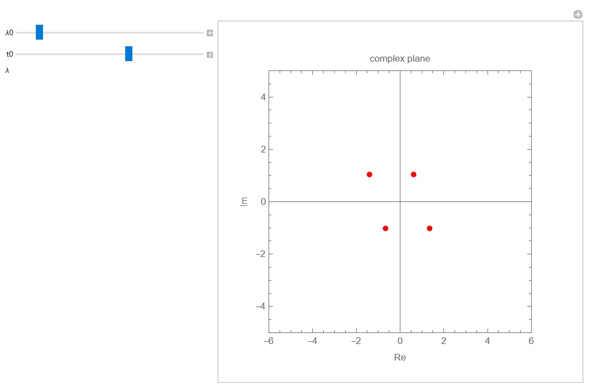
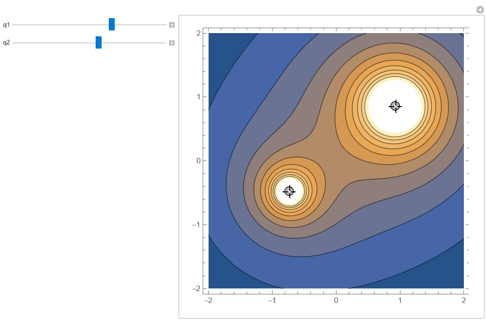

# An Introduction to Mathematica's Manipulate[] function

The Mathematica notebook offers a few simple examples using the `Manipulate[]` function.
This is extremely useful for visualising the behaviour of certain functions, as parameters are varied in an interactive manner.

The Mathematica notebook is self-contained and includes two examples. 

## Example 1: Elliptic curves

The first use of the `Manipulate[]` function is an application of 'Seiberg-Witten' geometry, which is one of the research areas I am interested in.
We are dealing with a family of elliptic curves, described by a cubic equation:

$$ y^2 = 4x^3 - g_2(U) x - g_3(U)~.$$

Here $U$ parametrizes the so-called 'vacuum moduli space', being thus of central interest.
Meanwhile, $g_2$ and $g_3$ are polynomial functions in $U$, and might also depend on other parameters.
We define the discriminant of the curve as:

$$ \Delta(U) = g_2(U)^3 - 27 g_3(U)^2~,$$

and we are looking for the zeros of this function.
In simple cases, these can be solved analytically, but this is not usually the case.
The examples we will look at is the local Hirzebruch $\mathbb{F}_0$ geometry, which engineers a five-dimensional superconformal field theory.
Explicitly, we have:

$$ \begin{aligned}
g_2(U) & = \frac{4}{3} \left(1 + U^4 - \lambda + \lambda^2 - 2 U^2 (1 + \lambda)\right)~, \\
g_3(U) & = -\frac{4}{27} \left(-2 + 2 U^6 + 3 \lambda + 3 \lambda^2 - 2 \lambda^3 - 6 U^4 (1 + \lambda) + 3 U^2 (2 + \lambda + 2 \lambda^2)\right)~.
\end{aligned}$$

Here $\lambda$ is another complex parameter.
We can then compute the discriminant $\Delta$ as a function of $U$ and $\lambda$, which will be a quartic polynomial in $U$, whose roots we can find analytically:

$$ \Delta(U, \lambda) = 16 \lambda^2 (U^4 + (-1 + \lambda)^2 - 2 U^2 (1 + \lambda))~. $$

A question of interest is the following: <b> For what values of</b> $\lambda$ <b>will we see repeated roots? </b> 
While for this example the answer is simple, namely $\lambda = 1$, such solutions are not always so straightforward. 
The `Manipulate[]` function lets us visualize how these roots change on the complex $U$-plane, as we vary the parameter $\lambda$.
Here, we use a parametrization $\lambda = \lambda_0 e^{2\pi i \frac{t_0}{24}}$, with $\lambda_0$ and $t_0$ real parameters. 

Running the code, we get something that looks like this:

  

## Example 2: Electric potential due to point charges

A nice example from the Wolfram Documentation is that of the electrostatic potential for two point charges, where we can vary the strength of the two charges $q_1$ and $q_2$.
The value of the potential (up to a multiplicative constant) at a point $(x,y)$ can be evaluated using:

$$ V(x,y) = \frac{q_1}{|r_1 - r(x,y)|} + \frac{q_2}{|r_2 - r(x,y)|}~, $$

where $r_i$ is the position vector of charge $i$, for $i = 1,2$ and $r(x,y)$ is the position vector for a point with coordinates $(x,y)$.
The result of the code is shown below, where we draw lines of constant value.
Note that the code is written in an interactive environment, which allows one to simply drag the charges to different positions, as well as change their magnitudes.

  

